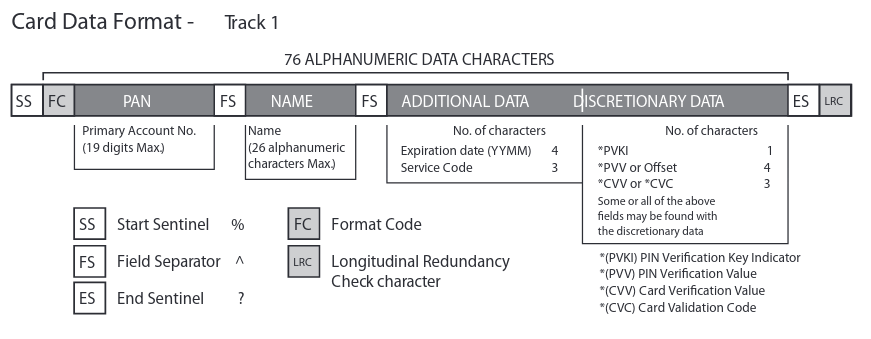
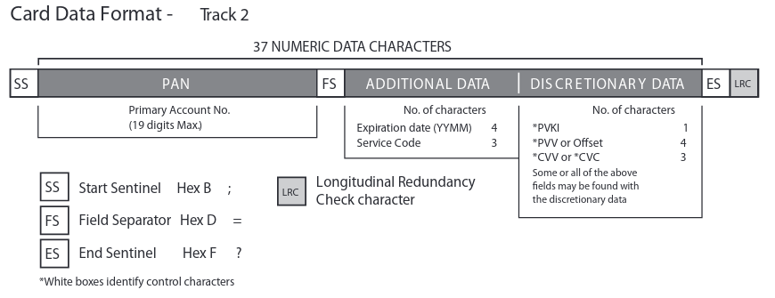
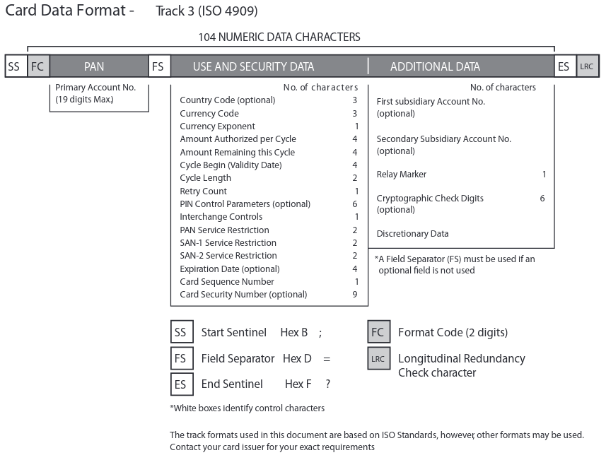

# MSR90
> A journey into learning about magnetic strip data in modern day cards

#### WORK IN PROGRESS
**Hardware:** [Deftun MSR90 3 Track Reader](https://www.amazon.com/MSR90-Magnetic-Credit-Reader-Deftun/dp/B01DUB4GVO/)

## Legal Disclaimer
The information and code provided in this repository are intended for educational and research purposes only, focusing on magnetic stripe data security and the documentation of the MSR90 magnetic card reader. The author of this repository does not endorse or promote the use of this information for fraudulent or illegal activities. The content is provided "as is" without warranty of any kind, express or implied. Neither the author nor the contributors shall be held liable for any damages arising from the use of this information. Users are encouraged to comply with all applicable laws and regulations regarding magnetic stripe data usage.

## Information
This repository serves as a personal exploration of magnetic stripe data as used in modern payment systems. The focus is on understanding the formatting of magnetic strip data, the mechanics of how systems interpret this data, and the associated security risks and vulnerabilities.

Despite the widespread use of magnetic stripe technology in financial transactions, there is a notable scarcity of accessible information and practical code examples on this topic.

Let's hope we don't get Banned 🤷

###### Initial discover & observances
To my suprise, most of these card readers act as an HID that mimics a keyboard. Simply put, you swipe a card and it types the data out that is on the magnetic strip. Also to my suprise these work out of the box on Linux & Android systems.

## Financial Cards
These follow the ISO/IEC 7813 standard which define the properties of financial transaction cards.

### Track 1


Track 1 is written with code known as DEC SIXBIT plus odd parity.

It can contain up to 79 characters.

Most bank cards are using format B

###### Additional un-common formats
| Format | Description                                     |
| ------ | ----------------------------------------------- |
| A      | Reserved for proprietary use of the card issuer |
| C-M    | Reserved for use by ANSI Subcommittee X3B10     |
| N-Z    | Available for use by individual card issuers    |

###### Example data
```
%B4815881002867896^YATES/EUGENE JOHN         ^37829821000123456789?
%B4815881002861896^YATES/EUGENE L            ^^^356858      00998000000? 
```

### Track 2


It can contain up to 40 characters.

### Track 3


It can contain up to 107 characters *(same density as track 1 but has the same character encoding as track 2)*

Most cards do not even use a 3rd track, and is mostly un-used worldwide.

### Service Code
###### First digit
| Code | Description                                                                                |
| ---- | ------------------------------------------------------------------------------------------ |
| 1    | International interchange OK                                                               |
| 2    | International interchange, use IC *(chip)* where feasible                                  |
| 5    | National interchange only except under bilateral agreement                                 |
| 6    | National interchange only except under bilateral agreement, use IC *(chip)* where feasible |
| 7    | No interchange except under bilateral agreement *(closed loop)*                            |
| 9    | Test                                                                                       |

###### Second digit
| Code | Description                                                                              |
| ---- | ---------------------------------------------------------------------------------------- |
| 0    | Normal                                                                                   |
| 2    | Contact issuer via online means                                                          |
| 4    | Contact issuer via online means except under bilateral agreement                         |

###### Third digit
| Code | Description                                                 |
| ---- | ----------------------------------------------------------- |
| 0    | No restrictions, PIN required                               |
| 1    | No restrictions                                             |
| 2    | Goods and services only *(no cash)*                         |
| 3    | ATM only, PIN required                                      |
| 4    | Cash only                                                   |
| 5    | Goods and services only *(no cash)*, PIN required           |
| 6    | No restrictions, use PIN where feasible                     |
| 7    | Goods and services only *(no cash)*, use PIN where feasible |

### Major Industry Identifier *(MII)*
| Number | Description                                                                                                              |
| ------ | ------------------------------------------------------------------------------------------------------------------------ |
| 0      | ISO/TC 68 and other industry assignments                                                                                 |
| 1      | Airlines                                                                                                                 |
| 2      | Airlines, financial and other future industry assignments                                                                |
| 3      | Travel and entertainment                                                                                                 |
| 4      | Banking and financial                                                                                                    |
| 5      | Banking and financial                                                                                                    |
| 6      | Merchandising and banking/financial                                                                                      |
| 7      | Petroleum and other future industry assignments                                                                          |
| 8      | Healthcare, telecommunications and other future industry assignments                                                     |
| 9      | For assignment by national standards bodies *(next 3 digits are [ISO 3166-1](https://en.wikipedia.org/wiki/ISO_3166-1))* |

### Issuer Identification Number *(IIN)*
| Issuer                    | INN Range                       | PAN Digits |
| ------------------------- | ------------------------------- | ---------- |
| American Express          | 34-37                           | 15         |
| China Union Pay           | 62                              | 16-19      |
| Diners Club International | 36, 38, 39, 309, 300-3005       | 14         |
| Discover                  | 65, 644-649, 6011 622126-622925 | 16, 19     |
| JCB                       | 3528-3589                       | 16         |
| Maestro                   | 50, 56-69                       | 12-19      |
| Mastercard                | 51-55, 2221-2720                | 16         |
| RuPay                     | 607                             | 16         |
| Visa                      | 4                               | 12, 16, 19 |

## References
- [Digital Card](https://en.wikipedia.org/wiki/Digital_card)
- [Magnetic Stripe Card Standards](https://www.magtek.com/content/documentationfiles/d99800004.pdf)
- [ISO/IEC 7813](https://en.wikipedia.org/wiki/ISO/IEC_7813)
- [ISO/IEC 7812](https://en.wikipedia.org/wiki/ISO/IEC_7812)
___

###### Mirrors for this repository: [acid.vegas](https://git.acid.vegas/msr90) • [SuperNETs](https://git.supernets.org/acidvegas/msr90) • [GitHub](https://github.com/acidvegas/msr90) • [GitLab](https://gitlab.com/acidvegas/msr90) • [Codeberg](https://codeberg.org/acidvegas/msr90)
